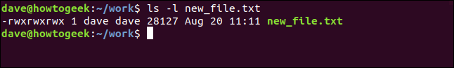
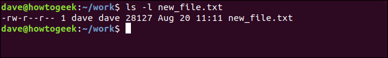
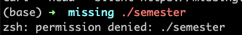
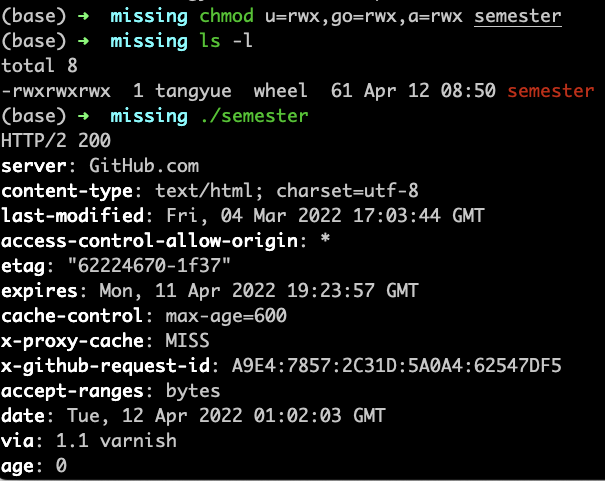
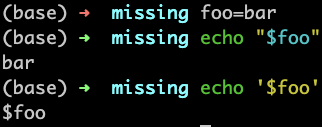

# Missing semester


## shell basics

- Navigating in shell
  - Path:
    - `.`
    - `..`
    - `/` `~`
    - `pwd`
  - `ls`
  - `mv`
  - `cp`
  - `mkdir`

```
missing:~$ ls -l /home
drwxr-xr-x 1 missing  users  4096 Jun 15  2019 missing
```

这个参数可以打印出更加详细地列出目录下文件或文件夹的信息。首先，本行==第一个字符 `d` 表示 `missing` 是一个目录。==然后接下来的九个字符，每三个字符构成一组。 （`rwx`）. 它们分别代表了文件所有者（`missing`），用户组（`users`） 以及其他所有人具有的权限。其中 `-` 表示该用户不具备相应的权限。从上面的信息来看，只有文件所有者可以修改（`w`），`missing` 文件夹 （例如，添加或删除文件夹中的文件）。为了进入某个文件夹，用户需要具备该文件夹以及其父文件夹的“搜索”权限（以“可执行”：`x`）权限表示。为了列出它的包含的内容，用户必须对该文件夹具备读权限（`r`）。对于文件来说，权限的意义也是类似的。注意，`/bin` 目录下的程序在最后一组，即表示所有人的用户组中，均包含 `x` 权限，也就是说任何人都可以执行这些程序。

- `echo`
- Redirection 
  - `<`
  - `>`
  - `>>`
  - `|`
- Permission 
  - `sudo` = do as a super user

#### practice

1. 在 `/tmp` 下新建一个名为 `missing` 的文件夹。

   ```sh
   mkdir missing
   ```

2. 用 `man` 查看程序 `touch` 的使用手册。

   ```shell
   man touch
   ```

3. 用 `touch` 在 `missing` 文件夹中新建一个叫 `semester` 的文件。

   `touch semester`

4. 将以下内容一行一行地写入`semester`文件：

   ```sh
    #!/bin/sh
    curl --head --silent https://missing.csail.mit.edu
   ```

   第一行可能有点棘手， `#` 在Bash中表示注释，而 `!` 即使被双引号（`"`）包裹也具有特殊的含义。 单引号（`'`）则不一样，此处利用这一点解决输入问题。更多信息请参考 [Bash quoting 手册](https://www.gnu.org/software/bash/manual/html_node/Quoting.html)

   ```shell
   echo '#!'/bin/sh > semester
   echo curl --head --silent https://missing.csail.mit.edu >> semester
   ```

5. 尝试执行这个文件。例如，将该脚本的路径（`./semester`）输入到您的shell中并回车。如果程序无法执行，请使用 `ls` 命令来获取信息并理解其不能执行的原因。

   - 权限不足，也就是输入`ls -l `命令后每行最前面的那10个字符

   To use `chmod` to set permissions, we need to tell it:

   - *Who:* Who we are setting permissions for.
   - *What*: What change are we making? Are we adding or removing the permission?
   - *Which*: Which of the permissions are we setting?

   We use indicators to represent these values, and form short “permissions statements” such as `u+x`, where “u” means ” user” (who), “+” means add (what), and “x” means the execute permission (which).

   The “who” values we can use are:

   - *u*: User, meaning the owner of the file.
   - *g*: Group, meaning members of the group the file belongs to.
   - *o*: Others, meaning people not governed by the `u` and `g` permissions.
   - *a*: All, meaning all of the above.

   if none of these are used, `chmod` behaves as if “`a`” had been used.

   The “what” values we can use are:

   - *–*: Minus sign. Removes the permission.
   - *+*: Plus sign. Grants the permission. The permission is added to the existing permissions. If you want to have this permission and only this permission set, use the `=` option, described below.
   - *=*: Equals sign. Set a permission and remove others.

   The “which ” values we can use are:

   - *r*: The read permission.
   - *w*: The write permission.
   - *x*: The execute permission.

   

   `chomod u=rw,go=r new_file.txt`

   

   

   

6. 查看 `chmod` 的手册(例如，使用 `man chmod` 命令) 

   `man chmod`

7. 使用 `chmod` 命令改变权限，使 `./semester` 能够成功执行，不要使用 `sh semester` 来执行该程序。您的 shell 是如何知晓这个文件需要使用 `sh` 来解析呢？更多信息请参考：[shebang](https://en.wikipedia.org/wiki/Shebang_(Unix))

   ```shell
   chmod u=rwx,go=rwx,a=rwx semester
   ```

8. 使用 `|` 和 `>` ，将 `semester` 文件输出的最后更改日期信息，写入主目录下的 `last-modified.txt` 的文件中

   ```shell
   ./semester | grep last-modified > last-modified.txt
   ```


## shell script


### bash script





### shell advance

https://missing-semester-cn.github.io/missing-notes-and-solutions/2020/solutions/shell-tools-solution/


## Vim

当我们编程的时候，<u>会经常在文件间进行切换、阅读、浏览和修改代码</u>，而不是连续编写一大段的文字。因此代码编辑器和文本编辑器是很不同的两种工具（例如微软的 Word 与 Visual Studio Code）

### Vim的哲学

在编程的时候，你会把大量时间花在阅读/编辑而不是在写代码上。所以，Vim 是一个_多模态_编辑 器：它对于插入文字和操纵文字有不同的模式。Vim 是可编程的（可以使用 Vimscript 或者像 Python 一样的其他程序语言），Vim 的接口本身也是一个程序语言：键入操作（以及其助记名） 是命令，这些命令也是可组合的。Vim 避免了使用鼠标，因为那样太慢了；Vim 甚至避免用 上下左右键因为那样需要太多的手指移动。

这样的设计哲学使得 Vim 成为了一个能跟上你思维速度的编辑器。

### Vim 进阶

这里我们提供了一些展示这个编辑器能力的例子。我们无法把所有的这样的事情都教给你，但是你 可以在使用中学习。一个好的对策是: 当你在使用你的编辑器的时候感觉 “一定有更好的方法来做这个”， 那么很可能真的有：上网搜寻一下。

#### 搜索和替换

`:s` （替换）命令（[文档](http://vim.wikia.com/wiki/Search_and_replace)）。

- ```plaintext
  %s/foo/bar/g
  ```

  - 在整个文件中将 foo 全局替换成 bar

- ```plaintext
  %s/\[.*\](\(.*\))/\1/g
  ```

  - 将有命名的 Markdown 链接替换成简单 URLs

#### 多窗口

- 用 `:sp` / `:vsp` 来分割窗口
- 同一个缓存可以在多个窗口中显示。

#### 宏

- `q{字符}` 来开始在寄存器`{字符}`中录制宏

- `q`停止录制

- `@{字符}` 重放宏

- 宏的执行遇错误会停止

- `{计数}@{字符}`执行一个宏{计数}次

- 宏可以递归

  - 首先用`q{字符}q`清除宏
  - 录制该宏，用 `@{字符}` 来递归调用该宏 （在录制完成之前不会有任何操作）

- 例子：将 xml 转成 json (

  file

  )

  - 一个有 “name” / “email” 键对象的数组

  - 用一个 Python 程序？

  - 用 sed / 正则表达式

    - `g/people/d`
    - `%s/<person>/{/g`
    - `%s/<name>\(.*\)<\/name>/"name": "\1",/g`
    - …

  - Vim 命令 / 宏

    - `Gdd`, `ggdd` 删除第一行和最后一行

    - 格式化最后一个元素的宏 （寄存器

       

      ```plaintext
      e
      ```

      ）

      - 跳转到有 `<name>` 的行
      - `qe^r"f>s": "<ESC>f<C"<ESC>q`

    - 格式化一个

      的宏

      - 跳转到有 `<person>` 的行
      - `qpS{<ESC>j@eA,<ESC>j@ejS},<ESC>q`

    - 格式化一个

      标签然后转到另外一个的宏

      - 跳转到有 `<person>` 的行
      - `qq@pjq`

    - 执行宏到文件尾

      - `999@q`

    - 手动移除最后的 `,` 然后加上 `[` 和 `]` 分隔符