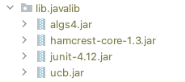
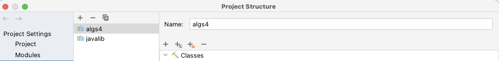
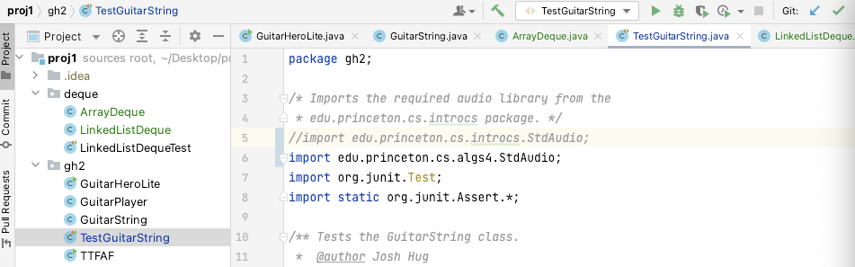
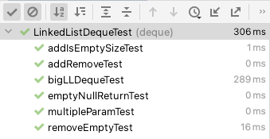
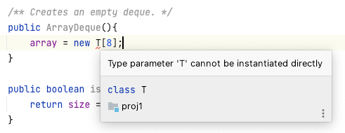
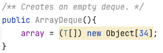

# Deque

- [x] `LinkedListDeque`(15min)
- [x] `ArrayDeque`(3h)
- [x] `GuitarString`(45min)


## Preparation

### lib and package

如果和我一样用`Maven`启动工程会失效，那这个项目的一些包就得手动配置。主要是下面这两个。如果你之前学过Princeton的算法4课程，题外话，非常建议，那应该按图索骥知道这两个库出自哪里。

```java
import edu.princeton.cs.algs4.StdAudio;
import edu.princeton.cs.algs4.StdDraw;
```

这里是官网的下载链接，在[这个页面](https://algs4.cs.princeton.edu/code/)仔细找`algs4.jar`这个包并下载匹配自己操作系统的版本（其实下哪个都无所谓）。

​		安装好后的重点是如何让它在你的IntelliJ中能够使用，很多方法都可以，我用的是这一种简单但是不太一劳永逸的。

步骤：

1. 项目目录下新建`lib`文件夹（如果没有的话，有的话直接点进去）
2. 然后把下载下来的`algs4.jar`文件拖进去，如下所示就可以
3. 然后File->Project Structure->Libraries 查看你的jiavalib是否在其中，在的话就点OK之间推出；不在的话点击左上角的小`+`号，然后选择`java`类型的导入，出现一个文件复选框，就直接选择整个`lib`文件打开，点击`Apply`然后点击`OK`
4. 重新运行`LinkedlistDequeTest`或类似的Test文件，然后大概率是没有问题。 可能有的小问题是`TestGuitarString`文件的头部`import...``algs4.jar`的路径不太对，要把``import edu.princeton.cs.introcs.StdAudio;`改成`import edu.princeton.cs.algs4.StdAudio;`注意观察下图。这样下来应该整个程序就可跑了，之后就可以开始我们的正式工作。


### Lecture and hints

- lab3 和 lab4 要认真完成后再进行proj1会顺利很多
- 可以参考项目文档写的提示并在不懂的时候仔细阅读多遍项目文档
- 出于acdamic integrity 最好不要去搜索实现过程并复制代码，可以参考lecture给出的slides和`SLList`以及`AList`的完整实现过程，以及独自手打运行成功一遍两份代码。


## Data Structure

> Deque Implementation

**Deque = double linked two-ended queue**


### LinkedListDeque

- Source code:

  ```java
  /**
  * Deque implemention using Linked list
  * @author TOMYUE
  */
  package deque;
  
  public class LinkedListDeque<T> {
      /** nested class TNode */
      private class TNode{
          private T item;
          private TNode prev;
          private TNode next;
  
          /** constructor of a sentinel node. */
          public TNode(TNode prev, TNode next){
              this.prev = null;
              this.next = null;
          }
  
          /** constructor of a node with item, and pointers. */
          public TNode(T item, TNode prev, TNode next){
              this.item = item;
              this.prev = prev;
              this.next = next;
          }
      }
  
      private TNode sentinel;
      private int size;
  
      /** Creates an empty deque */
      public LinkedListDeque(){
              sentinel = new TNode(null, null);
              sentinel.prev = sentinel;
              sentinel.next = sentinel;
              size = 0;
      }
  
      /** Returns true if the deque is empty. */
      public boolean isEmpty(){
          return size == 0;
      }
  
      /** Returns the number of items in the deque. */
      public int size(){
          return size;
      }
  
      /** Adds item to the front of the deque. */
      public void addFirst(T item){
          TNode newNode = new TNode(item, sentinel, sentinel.next);
          sentinel.next.prev = newNode;
          sentinel.next = newNode;
          size += 1;
      }
  
      /** Adds item to the last of the deque. */
      public void addLast(T item){
          TNode newNode = new TNode(item, sentinel.prev, sentinel);
          sentinel.prev.next = newNode;
          sentinel.prev = newNode;
          size += 1;
      }
  
      /** Removes first item in the deque. */
      public T removeFirst(){
          if(size == 0){
              return null;
          }
  
          T firstItem = sentinel.next.item;
          sentinel.next.next.prev = sentinel;
          sentinel.next = sentinel.next.next;
          size -= 1;
          return firstItem;
      }
  
      /** Removes last item in the deque. */
      public T removeLast(){
          if(size == 0){
              return null;
          }
  
          T lastItem = sentinel.prev.item;
          sentinel.prev.prev.next = sentinel;
          sentinel.prev = sentinel.prev.prev;
          size -= 1;
          return lastItem;
      }
  
      /** Gets the item at the given index. */
      public T get(int index){
          if(index +1 > size){
              return null;
          }
          TNode p = sentinel.next;
          while(index > 0){
              p = p.next;
              index -= 1;
          }
          return p.item;
      }
  
      /** Prints all the items in the deque. */
      public void printDeque(){
          TNode p = sentinel.next;
          while (p.next.next != sentinel){
              System.out.print(p.item + " ");
              p = p.next;
          }
          System.out.println(p.item);
      }
  }
  ```

- Result:

  


### ArrayDeque

- Source code:

  ```java
  /**
   * Deque implemention using Linked list
   * @author TOMYUE
   */
  package deque;
  
  public class ArrayDeque<T> {
      private T[] array;
  
      /** size of the deque, also means the number of elements between head and tail.*/
      private int size;
  
      /** define the original size of the array in deque. */
      private final int SIZE  = 8;
  
      /** Refactor constant when resizing the size of the array. */
      private final int REFACTOR = 2;
  
      /** head index of the array. */
      private int head;
  
      /** tail index of the array. */
      private int tail;
  
      /** length of the current array. */
      private int length;
  
  
      /** Creates an empty deque. */
      public ArrayDeque(){
          this.array = (T[]) new Object[SIZE];
          this.size = 0;
          this.head = 0;
          this.tail = 0;
          this.length = SIZE;
      }
  
      public boolean isEmpty(){
          return size == 0;
      }
  
      public int size(){
          return size;
      }
  
      /** when the size of array is to be less than the size of the deque elements, resize array. */
      private void resizeUp(){
          /* Create new copy array. */
          T[] temp = (T[]) new Object[array.length*REFACTOR];
  
          /* Copy the ArrayDeque elements to the temp array. */
          int ptr = head;
          int cnt = 0;
          while (ptr != tail){
              temp[cnt] = array[ptr];
              ptr = (ptr + 1 + length) % length;
              cnt += 1;
          }
          temp[cnt] = array[ptr];
  
          /* Copy back to array. */
          array = temp;
  
          /* Update head, tail and length. */
          head = 0;
          tail = size - 1;
          length = length*REFACTOR;
      }
  
      /** when the size of array is to be more than the size of the deque elements, resize array. */
      private void resizeDown(){
          /* Create new copy array. */
         T[] temp = (T[]) new Object[array.length/REFACTOR];
  
         /* Copy the ArrayDeque elements to the temp array. */
         int ptr = head;
         int cnt = 0;
         while (ptr != tail){
             temp[cnt] = array[ptr];
             ptr = (ptr + 1 + length) % length;
             cnt += 1;
         }
         temp[cnt] = array[ptr];
  
         /* Copy back to array. */
         array = temp;
  
         /* Update head, tail and length. */
          head = 0;
          tail = size - 1;
          length = length/REFACTOR;
      }
  
  
      public void addFirst(T item){
          if(size == 0){
              array[0] = item;
              size += 1;
              head = 0;
              tail = 0;
              return;
          }
          // if deque has been full, resize
          if(size + 1 > length){
              resizeUp();
          }
  
          head = (head - 1 + length) % length;
          array[head] = item;
          size += 1;
      }
  
      public void addLast(T item){
          if(size == 0){
              array[0] = item;
              size += 1;
              head = 0;
              tail = 0;
              return;
          }
          // if deque has been full, resize
          if(size + 1 > length){
              resizeUp();
          }
          
          tail = (tail + 1 + length) % length;
          array[tail] = item;
          size += 1;
      }
  
      public void printDeque(){
          int ptr = head;
          while (ptr != tail){
              System.out.print(array[ptr] + " ");
              ptr = (ptr + 1 + length) % length;
          }
          System.out.println(array[ptr]);
      }
  
      public T removeFirst(){
          if (size == 0) {
              return null;
          }
  
          T firstItem = array[head];
          head = (head + 1 + length) % length;
          size -= 1;
  
          /* resize the array */
          if(size < array.length/4 && !(size >=0 && size <=8)){
              resizeDown();
          }
  
          return firstItem;
      }
  
      public T removeLast(){
          if (size == 0) {
              return null;
          }
  
          T lastItem = array[tail];
          tail = (tail - 1 + length) % length;
          size -= 1;
  
          // resize the array
          if(size < array.length/4){
              resizeDown();
          }
  
          return lastItem;
      }
  
      public T get(int index){
          if (index < 0 || index >= size){
              return null;
          }
          int ptr = head;
          while(index > 0){
              ptr = (ptr + 1 + length) % length;
              index--;
          }
          return array[ptr];
      }
  
  }
  ```

- Result:

- Review:

  - 最初开始做的时候觉得这个实现应该很简单，但是，具体第一遍实现完以后用自己写的测试运行的时候就发现了细节的处理上还是有不少很tricky的地方，第一个是如果用循环的形式实现整个队列的下标运算时有几个选择问题：

    1. 哪个是第一个元素(或者把这个问题表述为哪个下标做为0和`length-1`之间的交换点)会更方便。
    2. 动态缩放数组大小的时候应该如何巧妙的拷贝原始数组，把`head` `tail` `size` `length`这些变量正确的替换。

    第二个难点就是动态缩放数组大小使得有效队列元素占有总数组元素率够高。

    所以，这两个主要难点带来的问题是`ArrayDeque`难点主要的来源。

    - 如下两个实现动态缩放的方式，是我最初的错误实现方法，用同样的拷贝的方式实现我暂时没有想到正确方法，您们如果有绝妙的想法，请一定指点我一下。暂且留作我的一个思考题。

    ```java
    /** when the size of array is to be less than the size of the deque elements, resize array. */
        private void resizeUp(){
            T[] resizedArray = (T[]) new Object[array.length * REFACTOR];
            int tempSize = length - head;
    
            System.arraycopy(array, head, resizedArray, 0, tempSize);
            System.arraycopy(array, 0, resizedArray, tempSize, size - tempSize);
            array = resizedArray;
            head = 0;
            tail = size - 1;
        }
    
        /** when the size of array is to be more than the size of the deque elements, resize array. */
        private void resizeDown(){
            T[] resizedArray = (T[]) new Object[array.length/2];
            if (tail < head){
                int tempSize = array.length - head;
                System.arraycopy(array, head, resizedArray, 0, tempSize);
                System.arraycopy(array, 0, resizedArray, tempSize, size - tempSize);
            }
            else {
                System.arraycopy(array, head, resizedArray, 0, size);
            }
            array = resizedArray;
            head = 0;
            tail = size - 1;
        }
    ```

    

  - 细节上：直接操作这样的类是不可行，错误类型如下所示，解决方法请各位大人最好能自行查找，初学时很容易忽视这样的小错误，解决方法我也列在下面，也会在所有四个`proj`统一的纠错和值得注意的编程小细节和稍微优化代码的文档里。

    Type parameter 'T' cannot be instantiated directly

  

  ​      改正方法：

  - 测试案例的构思：

    ```java
    package deque;
    
    import edu.princeton.cs.algs4.In;
    import org.junit.After;
    import org.junit.Test;
    
    import java.util.Optional;
    
    import static org.junit.Assert.*;
    
    /** Performs some basic array deque list tests. */
    public class ArrayDequeTest {
    
        @Test
        /** Adds a few things to the list, checking isEmpty and size() are corrext,
         * finally printing the results
         *
         * */
        public void addIsEmptySizeTest(){
            ArrayDeque<String> ad1 = new ArrayDeque<>();
            assertTrue("A newly initialized ADeque should be empty", ad1.isEmpty());
            ad1.addFirst("front");
    
            assertEquals(1, ad1.size());
            assertFalse(ad1.isEmpty());
    
            ad1.addFirst("middle");
            assertFalse(ad1.isEmpty());
    
            ad1.addLast("last");
            assertFalse(ad1.isEmpty());
    
            System.out.println("Printing out deque: ");
            ad1.printDeque();
        }
    
        @Test
        /** Adds continue items to the first.*/
        public void addContinueToFirst(){
            ArrayDeque<Integer> ad1 = new ArrayDeque<>();
            ad1.addFirst(1);
            ad1.addFirst(2);
            ad1.addFirst(3);
            ad1.printDeque();
            assertEquals(3, ad1.size());
        }
    
        @Test
        /** Adds continue items to last. */
        public void addContinueToLast(){
            ArrayDeque<Integer> ad1 = new ArrayDeque<>();
            ad1.addLast(1);
            ad1.addLast(2);
            ad1.addLast(3);
            ad1.printDeque();
        }
    
        @Test
        /** Adds continue items to see the results. */
        public void addContinueItem(){
            ArrayDeque<Integer> ad1 = new ArrayDeque<>();
            for (int i = 0; i < 10; ++i){
                ad1.addFirst(i);
            }
    
            ad1.printDeque();
    
            for (int i = 9; i >= 0; --i){
                int temp = ad1.removeFirst();
                assertEquals("each element squence", i, temp);
            }
        }
    
        @Test
        /** Adds an item, then removes an item, and ensures that ad2 is empty afterwards. */
        public void addRemoveTest() {
    
            ArrayDeque<Integer> ad2 = new ArrayDeque<>();
            assertTrue("ad2 should contain no item",ad2.isEmpty());
    
            ad2.addFirst(10);
            assertFalse("ad2 should contain 1 item",ad2.isEmpty());
    
            ad2.removeFirst();
            assertTrue("ad2 should contain no item", ad2.isEmpty());
        }
    
        @Test
        /** Tests removing from an empty deque. */
        public void removeEmptyTest(){
            ArrayDeque<Integer> ad1 = new ArrayDeque<>();
            ad1.addFirst(10);
    
            ad1.removeFirst();
            ad1.removeLast();
            ad1.removeFirst();
            ad1.removeLast();
    
            assertTrue("Deque should be empty", ad1.isEmpty());
        }
    
        @Test
        /** Check if you can create ArrayDeques with different parameterized types. */
        public void multiParameters(){
            ArrayDeque<Integer> ad1 = new ArrayDeque<>();
            ArrayDeque<String>  ad2 = new ArrayDeque<>();
            ArrayDeque<Double> ad3 = new ArrayDeque<>();
    
            ad1.addFirst(10);
            ad2.addFirst("One");
            ad3.addFirst(10.0);
    
            Integer x = ad1.removeFirst();
            String y = ad2.removeFirst();
            Double z = ad3.removeFirst();
    
        }
    
        @Test
        /** Check if null is return when removing from an empty ArrayDeque. */
        public void emptyNullReturn(){
            ArrayDeque<Integer> ad1 = new ArrayDeque<>();
    
            assertEquals("Remove from the front of the deque should be null", null, ad1.removeFirst());
            assertEquals("Remove from the last of the deque should be null", null, ad1.removeLast());
        }
    
        @Test
        /** Add large number of elements to deque; check if order is correct.*/
        public void checkLargeNumberOrders() {
            ArrayDeque<Integer> ad1 = new ArrayDeque<>();
    
            for(int i = 0; i < 100000; ++i){
                ad1.addLast(i);
            }
    
            for(double i = 0; i < 50000; ++i){
                assertEquals(i, (double) ad1.removeFirst(), 0.0);
            }
    
            for(double i = 99999; i > 50000; --i){
                assertEquals(i, (double) ad1.removeLast(), 0.0);
            }
        }
    
    }
    ```

    

## Appilcation


### GuitarString

```java
package gh2;

// TODO: uncomment the following import once you're ready to start this portion
import deque.ArrayDeque;
// TODO: maybe more imports

//Note: This file will not compile until you complete the Deque implementations
public class GuitarString {
    /** Constants. Do not change. In case you're curious, the keyword final
     * means the values cannot be changed at runtime. We'll discuss this and
     * other topics in lecture on Friday. */
    private static final int SR = 44100;      // Sampling Rate
    private static final double DECAY = .996; // energy decay factor

    /* Buffer for storing sound data. */
    // TODO: uncomment the following line once you're ready to start this portion
     private ArrayDeque<Double> buffer;

    /* Create a guitar string of the given frequency.  */
    public GuitarString(double frequency) {
        // TODO: Create a buffer with capacity = SR / frequency. You'll need to
        //       cast the result of this division operation into an int. For
        //       better accuracy, use the Math.round() function before casting.
        //       Your should initially fill your buffer array with zeros.
        int capacity = (int) Math.round(SR/frequency);
        buffer = new ArrayDeque<Double>();
        for(int i = 0; i < capacity; ++i){
            buffer.addLast(0.0);
        }
    }


    /* Pluck the guitar string by replacing the buffer with white noise. */
    public void pluck() {
        // TODO: Dequeue everything in buffer, and replace with random numbers
        //       between -0.5 and 0.5. You can get such a number by using:
        //       double r = Math.random() - 0.5;
        //
        //       Make sure that your random numbers are different from each
        //       other. This does not mean that you need to check that the numbers
        //       are different from each other. It means you should repeatedly call
        //       Math.random() - 0.5 to generate new random numbers for each array index.
        int dequeSize = buffer.size();
        for(int i = 0; i < dequeSize; ++i){
            buffer.removeFirst();
        }
        for(int i = 0; i < dequeSize; ++i){
            buffer.addLast(Math.random() - 0.5);
        }
    }

    /* Advance the simulation one time step by performing one iteration of
     * the Karplus-Strong algorithm.
     */
    public void tic() {
        // TODO: Dequeue the front sample and enqueue a new sample that is
        //       the average of the two multiplied by the DECAY factor.
        //       **Do not call StdAudio.play().**
        int size = buffer.size();
        for(int i = 0; i < size; ++i){
            double dequeNumber = buffer.removeFirst();
            double newNoiseElement = DECAY * (dequeNumber + buffer.get(0))*0.5;
            buffer.addLast(newNoiseElement);
        }
    }

    /* Return the double at the front of the buffer. */
    public double sample() {
        // TODO: Return the correct thing.
        return buffer.get(0);
    }
}
    // TODO: Remove all comments that say TODO when you're done.
```

- Review:

  最后一个类的测验只要按照文档和注释的提示完成就可以了。


