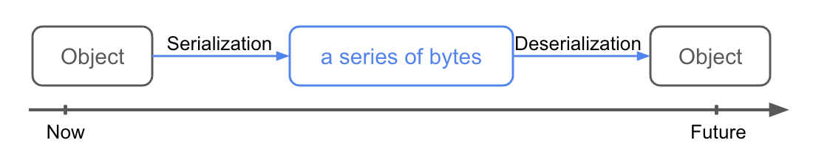

# Gitlit

[TOC]

## lab6 —prelude of proj2

### `Utils`

- **Read**
  - `readContents(File file)` ==reads in a file as a byte array==
  - `readContentsAsString(File file).  `==reads in a file as a string==` String(readContents(file), StandardCharsets.UTF-8)`
  - `static <T extends Serializable> T readObject(File file,Class<T> expectedClass) `==reads in a serializable object from a file==
    - Using `<Class name>.class` get a `class` `Dog d = readobject(inFile, Dog.class)`

- **Write**
  - `writeContents(File file, Object... contents)` 
- **Path**
  - `static File join(String first, String... others)`  joins together strings or files into a path
    - `Utils.join(".capers", "dogs")` would give you a `File`object with the path of `.capers/dogs`
    - `Utils.join(".capers", "dogs", "shitzus")` would give you a `File` object with the path of `.capers/dogs/shitzus` 
  - `static File join(File first, String... others)` 
- **Helper function**
  - `static byte[] serialize(Serializable obj) ` 返回包含连续性含义的`byte array`
- **Error control**
  - `public static void exitWithError(String message)`
  - `static RuntimeException error(String msg, Object... args)`



`Utils`

Serialization

```java
Model m;
File outFile = new File(saveFileName);

// Serializing the Model object
writeObject(outFile, m);
```

Deserialization

```java
Model m;
File inFile = new File(saveFileName);

// Desseializing the Model object
m = readObject(inFile, Model.class)
```


### task

- [ ] CapersRepositroy.java
- [ ] Dog.java
- [ ] Main.java