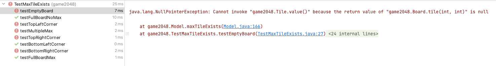

# Game 2048


## Environment Preparation

参见项目指导书[game2048](https://sp21.datastructur.es/materials/proj/proj0/proj0)


## Main task

- [x] `emptySpaceExists(Board b)`

  - [x] Time take(1h)

    

- [x] `maxTileExists(Board b)`

  - [x] Time take(5min)

    

- [x] `atLeastOneMoveExists(Board b)`

  - [x] Time take(15min)

    

- [x] `tilt(Side side)`

  - [x] Time take(3h)

    

### `emptySpaceExists(Board b)`

#### Related class

- `Board`

  - `tile` method

    ```java
    /** Return the current Tile at (COL, ROW), where 0 <= ROW < size(),
         *  0 <= COL < size(). Returns null if there is no tile there. */
        public Tile tile(int col, int row) {
            return vtile(col, row, viewPerspective);
        }
    ```

    

- `TestEmptySpace`

  共有8个测试案例，其中前6个是棋盘上有空（return true），后两个全满（return false）的

  | test | return |
  | ---- | ------ |
  | 1    | true   |
  | 2    | true   |
  | 3    | true   |
  | 4    | true   |
  | 5    | true   |
  | 6    | true   |
  | 7 满 | false  |
  | 8 满 | false  |

  

- `Tile`（棋子类）

  这个类定义了每一个**棋子**的状态，包括：数值、列、行、和下一个棋子。可以看作是一个有三个值一个指针的链表。

  ```java
  /** Represents the image of a numbered tile on a 2048 board.
   *  @author P. N. Hilfinger.
   */
  public class Tile {
  
      /** A new tile with VALUE as its value at (ROW, COL).  This
       *  constructor is private, so all tiles are created by the
       *  factory methods create, move, and merge. */
      private Tile(int value, int col, int row) {
          this.value = value;
          this.row = row;
          this.col = col;
          this.next = null;
      }
  ```

  - `create`
  - `move`
  - `merge`
  - `next`

- `Model`

​		

#### Solution

Solution 1:

 ```java
 public static boolean emptySpaceExists(Board b) {
         // TODO: Fill in this function.
         int count = 0; // count the number of empty tiles
         int board_size = b.size();
         for(int i = 0; i < board_size; ++i){
             for(int j = 0; j < board_size; ++j){
                if( b.tile(i,j) == null){
                    count++;
                }
             }
         }
         return count != 0;
     }
 ```


Solution 2: Modified on the solution 1

```java
/** Returns true if at least one space on the Board is empty.
 *  Empty spaces are stored as null.
 * */
public static boolean emptySpaceExists(Board b) {
    // TODO: Fill in this function.
    int board_size = b.size();
    for(int i = 0; i < board_size; ++i){
        for(int j = 0; j < board_size; ++j){
            if( b.tile(i,j) == null){
               return true;
            }
        }
    }
    return false;
}
```


#### Review

​	第一个`task`的难度不在于思路而在于：

	1. 阅读理解`game2048`文档，配置换进并了解测试程序的使用。
	1. 看懂各个类之间的调用关系，每个类所定义的变量、提供的接口。
	1. 对于某些看不懂的`Java`前置引用概念的不理解就使用。

思路就是一个对于一个二维数组的遍历，去看每个元素的值是否为`null`，但是就如指导书里说的那样，封装的`Board`类中定义了`private Tiel[][] values;`所以无法直接调用，只能通过`Board`中的这两个函数进行调用

```java
 /** Return the current Tile at (COL, ROW), when sitting with the board
     *  oriented so that SIDE is at the top (farthest) from you. */
    private Tile vtile(int col, int row, Side side) {
        return values[side.col(col, row, size())][side.row(col, row, size())];
    }

    /** Return the current Tile at (COL, ROW), where 0 <= ROW < size(),
     *  0 <= COL < size(). Returns null if there is no tile there. */
    public Tile tile(int col, int row) {
        return vtile(col, row, viewPerspective);
    }
```

于是我们就很清楚，具体该怎么做了，正如项目指导书中写的我们只会用到`.size()`和`.tile()`两个方法就可以完成，不过通过在逐个类中分析出来是一种有点累但却很快乐的方式。


### `maxTileExists(Board b)`

#### Related class

和`emptySpaceExists(Board b)`相同

#### Solution

```java
/**
     * Returns true if any tile is equal to the maximum valid value.
     * Maximum valid value is given by MAX_PIECE. Note that
     * given a Tile object t, we get its value with t.value().
     */
    public static boolean maxTileExists(Board b) {
        // TODO: Fill in this function.
        /**
         * if ( x == MAX_PIECE)
         *      then exit
         * */
        int board_size = b.size();
        for (int i = 0; i < board_size; ++i)
            for (int j = 0; j < board_size; ++j) {
                if (b.tile(i, j) == null) {
                } else {
                    if (b.tile(i, j).value() == MAX_PIECE)
                        return true;
                }
            }
        return false;
    }
```


#### Review

一开始直接写，没有考虑完整，碰到了这样的错，也就是提示我们要注意是空的位置的棋子的特殊情况。考虑到这点就没问题啦。




### `atLeastOneMoveExists(Board b)`

#### Related class

同前

#### Solution

```java
/**
     * Returns true if there are any valid moves on the board.
     * There are two ways that there can be valid moves:
     * 1. There is at least one empty space on the board.
     * 2. There are two adjacent tiles with the same value.
     */

    /** Auxilary funciton to test whether has same value tiles */
    public static boolean hasSameAdjacentTiles(Board b){
        int board_size = b.size();
        // test (n-1)*(n-1) size board
        for (int i = 0; i < board_size -1; ++i){
            for (int j = 0; j < board_size -1 ; ++j){
                if ((b.tile(i, j).value() == b.tile(i + 1, j).value()) || (b.tile(i, j).value() == b.tile(i, j + 1).value())){
                    return true;
                }
            }
        }
        // test n_th  col
        int col = board_size -1;
        for (int i = 0; i < board_size - 1; ++i){
           if (b.tile(col, i).value() == b.tile(col, i+1).value())
               return true;
        }
        // test n_th row
        int row = board_size -1;
        for (int j = 0; j < board_size - 1; ++j){
            if (b.tile(j, row).value() == b.tile(j+1, row).value())
                return true;
        }

        return false;
    }

		public static boolean atLeastOneMoveExists(Board b) {
        // TODO: Fill in this function.
        // condition 1
        boolean b1 = true;
        if (emptySpaceExists(b))
            return b1;
        else{ // condition 2
            if(hasSameAdjacentTiles(b))
                return b1;
            else
                return false;
        }
    }
```

#### Review

通过一个辅助函数`hasSameAdjacentTiles(Board b)`来遍历board查看是否有可移动的位置，只需做基础判断就可，比较容易。


### `tilt(Side side)`

#### Related class

- `Tile`
- `Board`
- `Modle`
- `Main`

#### Solution

```java
/** Tilt the board toward SIDE. Return true iff this changes the board.
     *
     * 1. If two Tile objects are adjacent in the direction of motion and have
     *    the same value, they are merged into one Tile of twice the original
     *    value and that new value is added to the score instance variable
     * 2. A tile that is the result of a merge will not merge again on that
     *    tilt. So each move, every tile will only ever be part of at most one
     *    merge (perhaps zero).
     * 3. When three adjacent tiles in the direction of motion have the same
     *    value, then the leading two tiles in the direction of motion merge,
     *    and the trailing tile does not.
     * */
//    public void moveToghterInline ()

    public boolean tilt(Side side) {
        boolean changed;
        changed = false;

        // TODO: Modify this.board (and perhaps this.score) to account
        // for the tilt to the Side SIDE. If the board changed, set the
        // changed local variable to true.

        // set the side to be NORTH, if it is not north, therefor easy to manipulate
        if (side != Side.NORTH) {
            board.setViewingPerspective(side);
        }
        // press up, and turn all the tiles be adjacent
        int board_size = board.size();
        for (int colIndex = 0; colIndex < board_size; ++colIndex){ // move all tiles in a line adjacent, col by col
            int nullCount = 0; // count how many null tile is before current tile in a line
            for (int rowIndex = board_size -1; rowIndex >= 0; --rowIndex){
                if(board.tile(colIndex, rowIndex) == null) {
                    nullCount++;
                    continue;
                }
                Tile t = board.tile(colIndex, rowIndex);
                if(board.tile(colIndex, rowIndex+nullCount) == null) {
                    board.move(colIndex, rowIndex + nullCount, t);
                    changed = true;
                }
            }
        }

        // merge if possible
        for (int colIndex = 0; colIndex < board_size; ++colIndex){
            for (int rowIndex = board_size -1; rowIndex > 0; --rowIndex){
                if((board.tile(colIndex, rowIndex) != null) && (board.tile(colIndex, rowIndex -1) != null) && (board.tile(colIndex, rowIndex).value() == board.tile(colIndex, rowIndex - 1).value())){
                    //Tile currentTile = board.tile(colIndex, rowIndex);
                    Tile nextTile = board.tile(colIndex, rowIndex-1);
                    board.move(colIndex, rowIndex, nextTile);
                    score += nextTile.value()*2;
                    changed = true;
                }
            }
        }

        // turn all tiles together again after merge
        for (int colIndex = 0; colIndex < board_size; ++colIndex){ // move all tiles in a line adjacent, col by col
            int nullCount = 0; // count how many null tile is before current tile in a line
            for (int rowIndex = board_size -1; rowIndex >= 0; --rowIndex){
                if(board.tile(colIndex, rowIndex) == null) {
                    nullCount++;
                    continue;
                }
                Tile t = board.tile(colIndex, rowIndex);
                if(board.tile(colIndex, rowIndex+nullCount) == null) {
                    board.move(colIndex, rowIndex+nullCount, t);
                }
            }
        }

        // turn the side back, if the origin side is not north
        if(side != Side.NORTH) {
            board.setViewingPerspective(Side.NORTH);
        }

        checkGameOver();
        if (changed) {
            setChanged();
        }

        return changed;
    }

    /** Checks if the game is over and sets the gameOver variable
     *  appropriately.
     */
    private void checkGameOver() {
        gameOver = checkGameOver(board);
    }

    /** Determine whether game is over. */
    private static boolean checkGameOver(Board b) {
        return maxTileExists(b) || !atLeastOneMoveExists(b);
    }

    /** Returns true if at least one space on the Board is empty.
     *  Empty spaces are stored as null.
     * */
    public static boolean emptySpaceExists(Board b) {
        // TODO: Fill in this function.
        int board_size = b.size();
        for(int i = 0; i < board_size; ++i){
            for(int j = 0; j < board_size; ++j){
               if( b.tile(i,j) == null){
                   return true;
               }
            }
        }
        return false;
    }
```


#### Review

这确实是整个proj0中最难的一个，难点在于：

1. 理解合并的过程，和游戏的规则，把文档提供的Google quiz轻易完成很有必要。
   1. **虽然不应该提醒，更应该是自己发现，这点搞错的话会做不了的，但是还是想说一下，这里的棋盘是以左下角为原点的，其他就不多说了，自己去`javadoc`里会慢慢发现的**
2. 处理复杂控制问题：向上，向下，向左，向右，排列在一起，合并，合并后再排列在一起
3. 细节处理：我在第一次完成后`debug`的时间大多花在了`nullPoiinterException`上了，发现是自己不小心用错了`.tilt()`函数后一切都顺利多了。
4. 处理顺序的考虑

我自己还有一些没做好的地方是这一部分的代码写得过于冗杂，不够简单，实现的方式也不够巧妙，下一周复习的时候再来思考一下应该怎么优化。


## Java Basic knowledge

#### static variable

- static variable is a variable that all classes could use.

- We generally use *static* methods to perform an operation that is not dependent upon instance creation.

  In order to share a code across all instances of that class, we write that code in a *static* method:

  ```java
  public static void setNumberOfCars(int numberOfCars) {
      Car.numberOfCars = numberOfCars;
  }
  ```

  We also commonly use *static* methods to create utility or helper classes so that we can get them without creating a new object of these classes.

  Just take a look at [Collections](https://docs.oracle.com/en/java/javase/11/docs/api/java.base/java/util/Collections.html) or [Math](https://docs.oracle.com/en/java/javase/11/docs/api/java.base/java/lang/Math.html) utility classes from JDK, [StringUtils](https://commons.apache.org/proper/commons-lang/apidocs/org/apache/commons/lang3/StringUtils.html) from Apache or [CollectionUtils](https://docs.spring.io/spring/docs/current/javadoc-api/org/springframework/util/CollectionUtils.html) from Spring framework and notice that all methods are *static*.


#### `assert`

粗浅理解一下是像写操作系统项目会遇到的assert（expression）函数，类似if-else的简单版，只有确保了expression为真才可以运行之后的语句。


#### final


#### For-each LOOP

Iterating over a collection is uglier than it needs to be. Consider the following method, which takes a collection of timer tasks and cancels them:

```java
void cancelAll(Collection<TimerTask> c) {
    for (Iterator<TimerTask> i = c.iterator(); i.hasNext(); )
        i.next().cancel();
}
```

The iterator is just clutter. Furthermore, it is an opportunity for error. The iterator variable occurs three times in each loop: that is two chances to get it wrong. The for-each construct gets rid of the clutter and the opportunity for error. Here is how the example looks with the for-each construct:

```java
void cancelAll(Collection<TimerTask> c) {
    for (TimerTask t : c)
        t.cancel();
}
```

When you see the colon (`:`) read it as "in." The loop above reads as "for each `TimerTask t` in `c`." As you can see, the for-each construct combines beautifully with [generics](https://docs.oracle.com/javase/8/docs/technotes/guides/language/generics.html). It preserves all of the type safety, while removing the remaining clutter. Because you don't have to declare the iterator, you don't have to provide a generic declaration for it. (The compiler does this for you behind your back, but you need not concern yourself with it.)

The for-each construct is also applicable to arrays, where it hides the index variable rather than the iterator. The following method returns the sum of the values in an `int` array:

```java
>// Returns the sum of the elements of a>
int sum(int[] a) {
    int result = 0;
    for (int i : a)
        result += i;
    return result;
}
```


#### Iterable<>

```java
public interface Iterable<T>
```

Implementing this interface allows an object to be the target of the "for-each loop" statement. See **[For-each Loop](https://docs.oracle.com/javase/8/docs/technotes/guides/language/foreach.html)**

In general, an object Implementing Iterable allows it to be iterated. An iterable interface allows an object to be the target of [enhanced for loop](https://www.geeksforgeeks.org/for-each-loop-in-java/)(for-each loop). 


