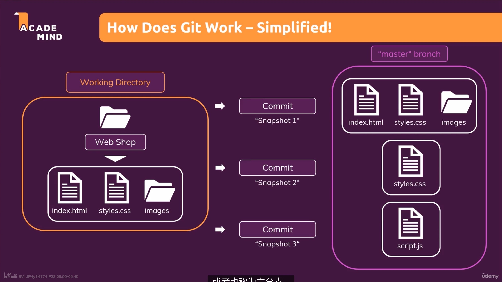
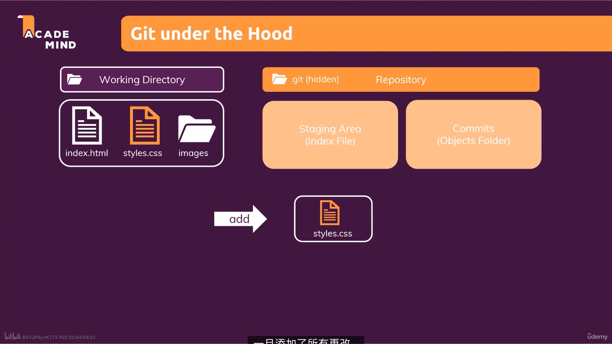

# git

## Git intro

### make a git repo

- To make a directory a git repo, we should use `git init` command. And `.git` file' existence is the criteria to test whether we have change a directory into a git repo.  

  

- Using `git status` we could know all the status information of our cuurent branch, like how many files have been modified, how many new files have been added, which file has been delete, whether we have uncommitted files, etc. 

  

  You will better comprehension on the `git status`, when seeing this snapshot.

  

   

- If we want to use the full function of the git, we could use git configure to configure some of our personal informations. See the document for more information.

  

### Working directory

Before add or commit every thing, we are work in the working directory. And by `git add . `or`git add *`command, we put our change into the stage area. And then by commit we put our change into the Repository(may be a repo hosted on the GitHub, normally)

### Stageing area

### Commit area

So one theory of git is: Git = Tracking changes - Not storing files again and again.

### branches & commits

If we have an idea on our project, but we don't really sure whethre we can make it or not. Then we could use`git branch new_branch_namw `git checkour -b new_branch_name` to create a whole new copy of our `main` branch (or in some situation we call it `master branch), and then we add new feature into this branch, therefore any changes we make will not make a impact on the original branch. And by using `git branch` we can simply find we are now on which branch.

### Delete data

####  Working dir

#### Unstaged changes

#### Staged changes

#### Lasted commits

#### Branches

`git ls-files`